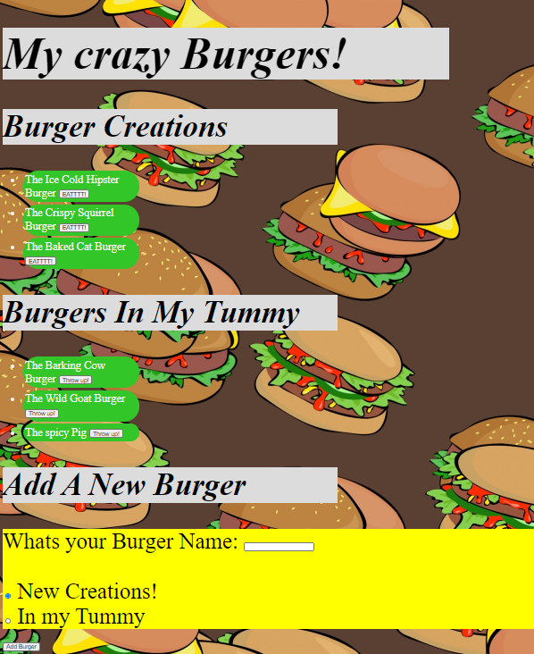

# Burgers

;
# My crazy Burger

## Description
This app lets you add new burger creation and givs you the option to eat or throw up any burger you've ate.
## Table of Contents
[Installation](#Installation)

[Usage](#Usage)

[License](#License)

[Questions](#Questions)
## Installation
install Inquirer
## Usage
Create, eat , throw up any Burgers
## License
This project is covered under the .
## Contact
If you have any additional questions, contact me by email or GitHub.

Email: Jcaro1993@gmail.com

GitHub: https://github.com/Jcaro1993